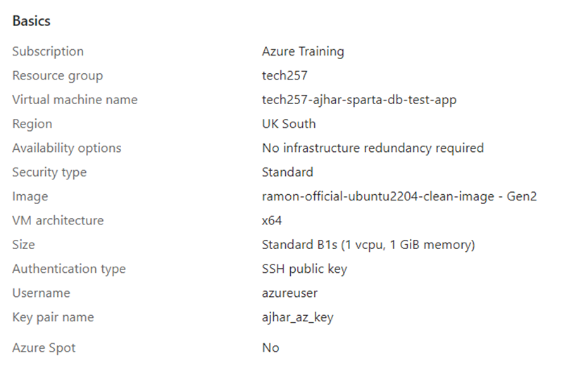
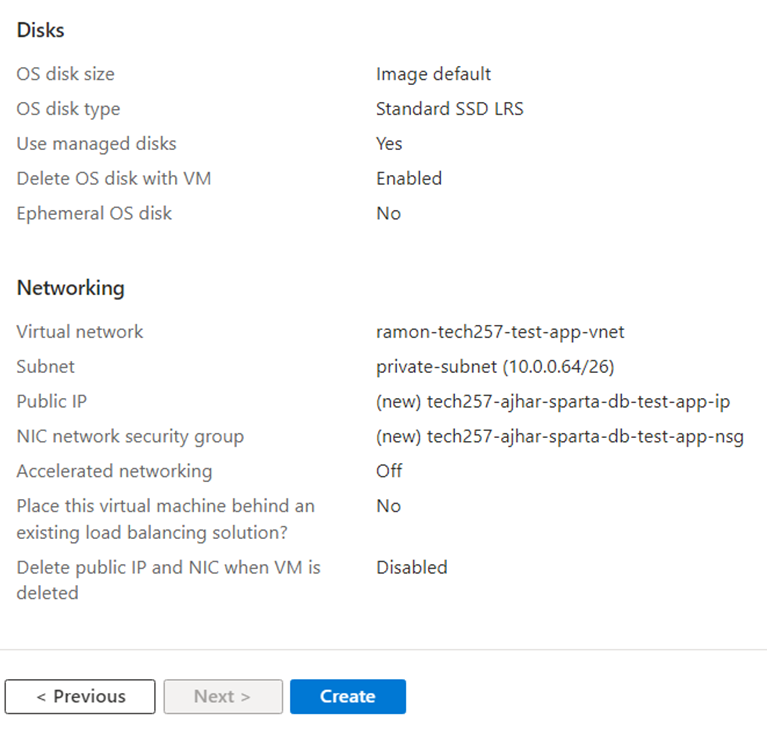
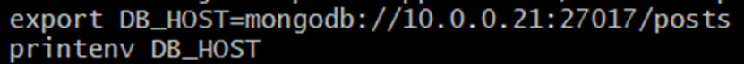
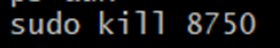

# Deployment Guide: MongoDB Database on Azure VM

## Important Notes

  We use the private IP address when connecting the app to the database for security reasons. Using the private IP avoids the need to open port 27017 in the security group and specify the port alongside the public IP. By default, Azure allows connections within the same VNet and stays within the VNet when using the private IP.

## Overview

The deployment process involves setting up a MongoDB database on an Azure VM manually and then automating it using a Bash script. Additionally, the process includes configuring the application to connect to the MongoDB database.

## Manual Setup

### Manually Setting Up VM:
**Creating a VM:**
  Configure the VM similar to previous instances with the   following specifications:
  - Use Ubuntu 22.04 LTS or a similar img/image.
  - Allow inbound port 22 for SSH.
  - Deploy the VM in a private subnet. Create a new security group (SG) that allows inbound port 22 TCP from any source.
<br>Review should look similar to this:<br>



1. **Update System**:
   `sudo apt-get update`

2. **Upgrade System**:
   `sudo DEBIAN_FRONTEND=noninteractive apt-get upgrade -y`

3. **Install Dependencies**:
   `sudo apt-get install gnupg curl`

4. **Add MongoDB GPG Key**:
   `curl -fsSL https://www.mongodb.org/static/pgp/server-7.0.asc | sudo gpg -o /usr/share/keyrings/mongodb-server-7.0.gpg --dearmor`

5. **Add MongoDB Repository**:
   `echo "deb [ arch=amd64,arm64 signed-by=/usr/share/keyrings/mongodb-server-7.0.gpg ] https://repo.mongodb.org/apt/ubuntu jammy/mongodb-org/7.0 multiverse" | sudo tee /etc/apt/sources.list.d/mongodb-org-7.0.list`

6. **Update Repository**:
   `sudo apt-get update`

7. **Install MongoDB**:
   `sudo apt-get install -y mongodb-org=7.0.6 mongodb-org-database=7.0.6 mongodb-org-server=7.0.6 mongodb-mongosh=2.1.5 mongodb-org-mongos=7.0.6 mongodb-org-tools=7.0.6`

8. **Hold Package Versions**:
   ```
    echo "mongodb-org hold" | sudo dpkg --set-selections
    echo "mongodb-org-database hold" | sudo dpkg --set-selections
    echo "mongodb-org-server hold" | sudo dpkg --set-selections
    echo "mongodb-mongosh hold" | sudo dpkg --set-selections
    echo "mongodb-org-mongos hold" | sudo dpkg --set-selections
    echo "mongodb-org-tools hold" | sudo dpkg --set-selections
    ```

9. **Configure MongoDB Bind IP**:
   Modify the MongoDB configuration file to allow inbound traffic from all sources within the VNet:
   `sudo vim /etc/mongod.conf` and change bind ip to 0.0.0.0 to allow inbound from all traffic within the vnet.

10.  **Start MongoDB Service**:
 ```
 sudo systemctl start mongod
 sudo systemctl enable mongod
 ```

11.   **Check MongoDB Service Status**:
 `sudo systemctl status mongod`

### Connect Application to MongoDB

1. **Set Environment Variable**:
   - SSH into the application VM.
   - Set up the environment variable to connect the application to the MongoDB database. The `-E` flag is used with `sudo` to preserve the current user's environment variables:
     ```bash
     export DB_HOST=mongodb://<private-ip-of-database>:27017/posts
     ```
     

2. **Stop Current Application Process**:
   - Change into the app directory and stop the current application process to register the database connection upon restarting it. In this case, use a kill command on the pm2 process running the app.
    <br>
    Then install npm and start the application
     ```bash
     sudo -E npm install
     sudo -E npm start
     ```

1. **Verify Connection**:
   - Check if the application is connected properly by adding the `/posts` extension to the application address (`<application-domain>/posts`). This should display the correct webpage.

## Automated Setup

### Bash Script for Database Deployment:

```bash
#!/bin/bash

# Update and upgrade the system
sudo apt-get update
sudo DEBIAN_FRONTEND=noninteractive apt-get upgrade -y

# Install dependencies
sudo apt-get install gnupg curl

# Add MongoDB GPG Key
curl -fsSL https://www.mongodb.org/static/pgp/server-7.0.asc | sudo gpg -o /usr/share/keyrings/mongodb-server-7.0.gpg --dearmor

# Add MongoDB Repository
echo "deb [ arch=amd64,arm64 signed-by=/usr/share/keyrings/mongodb-server-7.0.gpg ] https://repo.mongodb.org/apt/ubuntu jammy/mongodb-org/7.0 multiverse" | sudo tee /etc/apt/sources.list.d/mongodb-org-7.0.list

# Update Repository
sudo apt-get update

# Install MongoDB
sudo apt-get install -y mongodb-org=7.0.6 mongodb-org-database=7.0.6 mongodb-org-server=7.0.6 mongodb-mongosh=2.1.5 mongodb-org-mongos=7.0.6 mongodb-org-tools=7.0.6

# Hold Package Versions
echo "mongodb-org hold" | sudo dpkg --set-selections
echo "mongodb-org-database hold" | sudo dpkg --set-selections
echo "mongodb-org-server hold" | sudo dpkg --set-selections
echo "mongodb-mongosh hold" | sudo dpkg --set-selections
echo "mongodb-org-mongos hold" | sudo dpkg --set-selections
echo "mongodb-org-tools hold" | sudo dpkg --set-selections

# Configure MongoDB Bind IP
sudo sed -i 's@127.0.0.1@0.0.0.0@' /etc/mongod.conf

# Start MongoDB Service
sudo systemctl start mongod
sudo systemctl enable mongod
