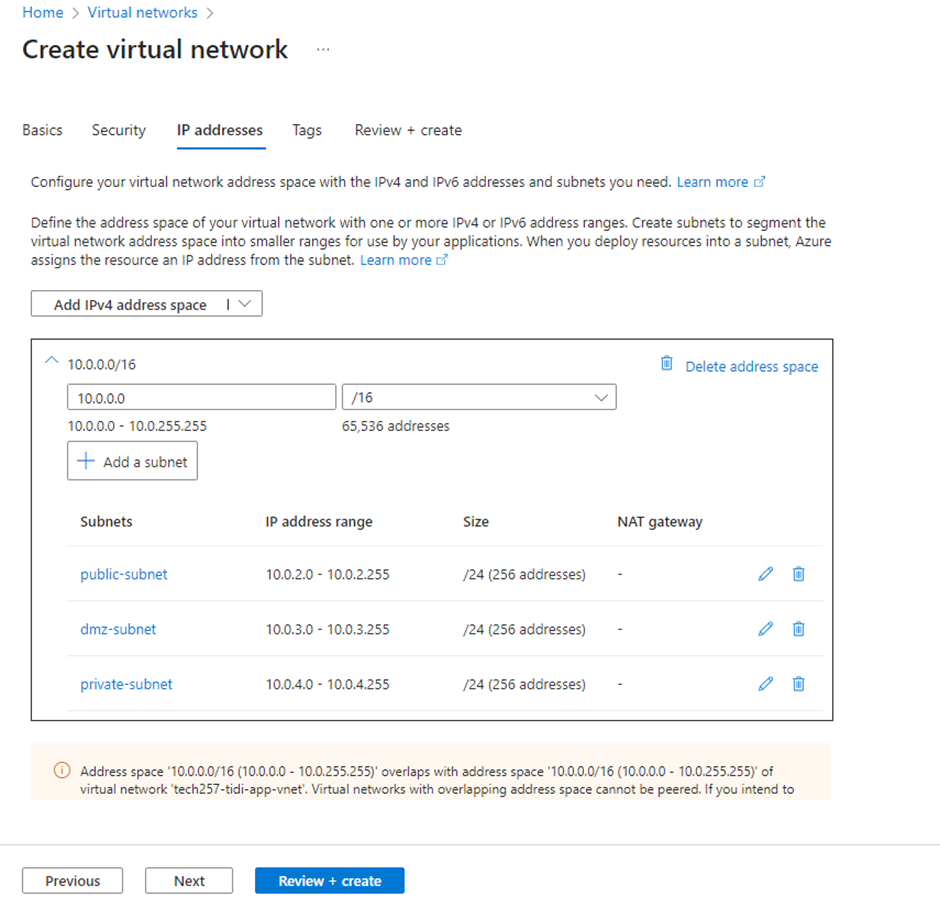
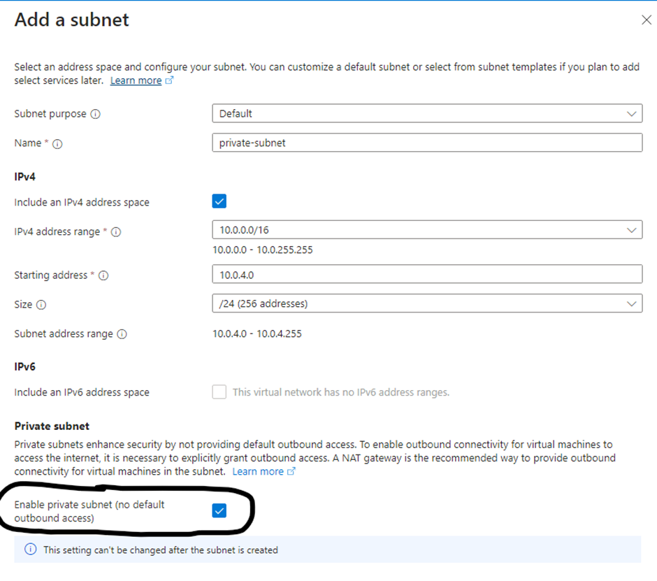
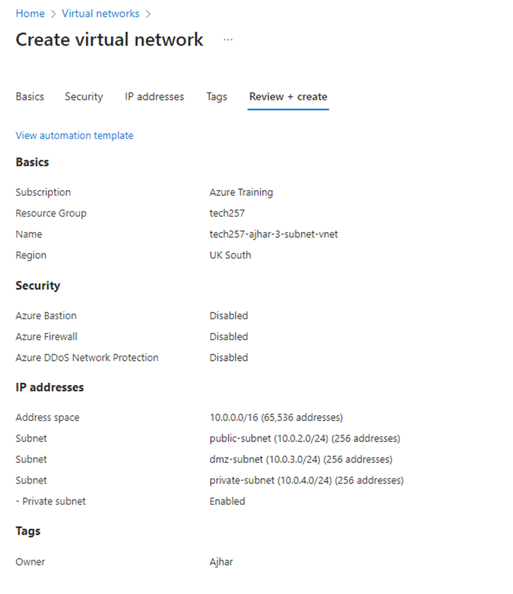
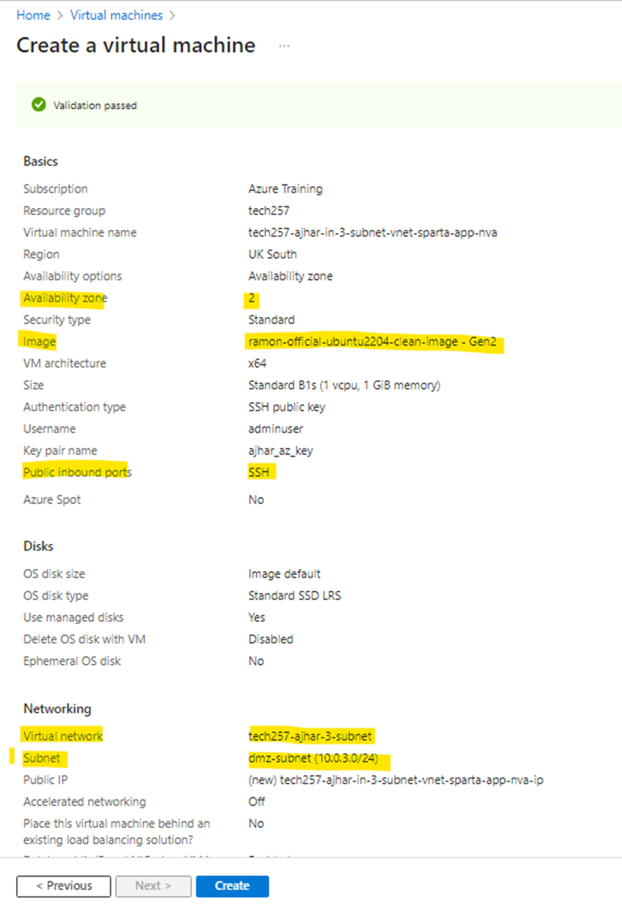
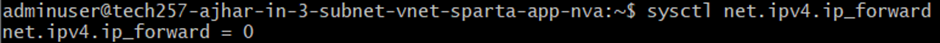
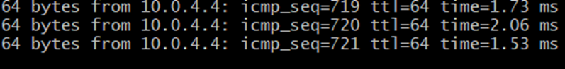

# Azure Monitoring and alert management

1. **Monitoring and creating dashboards**

    a. What is worst to best in terms of monitoring and responding to load/traffic?
    
      - The worst way is to manually monitor a dashboard and respond to changes. This approach is prone to missing spikes in traffic and delays in response.
        
      - A better method is to set up Azure monitoring and create alarms on specific metrics. This notifies responsible workers to respond promptly.
        
      - The best way is to automate monitoring with autoscaling. An autoscaling service adjusts resources automatically based on predefined policies and demand.
        
    b. How to setup a dashboard?
    
      - Go to the virtual machine, navigate to monitoring, and pin the desired charts. Azure will prompt to create a dashboard.
      
        
      - Access the dashboard by searching for `Dashboard Hub` -> `Overview`. Your created dashboards with charts will be available there.
        
    c. How did a combination of load testing and the dashboard help us?
    
      - Load testing allowed us to visualize CPU usage on the dashboard, helping us identify and respond to spikes in CPU usage if necessary.
        
    d. Screenshot of Dashboard when it stops responding through extreme load testing.
    
    
2. **Create CPU Usage Alert**
   
    - Click on one of the charts in the dashboard to create an alert rule. 
    - Set up the alert to check the average CPU usage for each minute.
     
    - Set up action for when alert is triggered.
    
    - Here is a screenshot of the email notification, and the chart.
    
    

We have successfully, created a dashboard and alert rule.

# Creating an Azure Scale Set

To create a scale set:

1. **Use an Appropriate Name and Image**
   
    - Choose a suitable name and use the ready-to-run application image.
    
   
2. **Network Configuration**
   
    - In the networking tab, select your virtual network (VNet) and click the edit button on the available network interface.
    

    - Select `Basic` in the "NIC network security group" section to create a new network security group. Allow access on ports 80 and 22. Click `OK`.
    
    
3. **Load Balancer Configuration**
   
    - At the bottom of the networking page, select "Azure Load Balancer" and create a load balancer.
    
    
    - Ensure the default settings are configured appropriately. Change the name as needed.
    
    
4. **Scaling Configuration**
   
    - In the "Scaling" section, click `Custom` and configure the settings according to your needs. For high availability, set the initial instance count to 2.
    
    
5. **Health Monitoring**
   
    - Ensure there is enough application health monitoring. By default, health checks are done on port 80 to look for healthy HTTP requests. This allows the scale set to know when to create or delete instances.
    
    
6. **Advanced Configuration**
   
    - In the "Advanced" section, add the user data to run the application upon boot.
    
    
7. **Tags and Review**
   
    - Select appropriate tags and click `Review and Create` once you are satisfied.
     
    
8. **Deployment**
   
    - Once deployed, go to the scale set resource. In the overview page, you should see the public IP of your application load balancer. Entering this IP into the browser should display your application.
    
    
9. **Congratulations!**
   
    - You have successfully launched a scale set.
  

## Purpose of using Azure Scale Sets

### Load balancer
- The purpose of the load balancer is to distribute traffic across the instances, it will also be the public access point to our vms and scale set.

### Managing instances
- The purpose of creating a scale set is to manage instances for us, as you may have noticed in set-up process or diagram we have set desired configuration to create/delete instances depending on application traffic and instance state.

- To test the scale set, we can create an unhealthy instance by restarting one of the provisioned instances, this will cause it to be unhealthy because the application running on it was launched via userdata which only runs at boot and not everytime it starts up.

### How to SSH into an instance
- The way we setup our scale set and its security group will not allow ssh access to our instances directly from the internet (we can only ssh directly from within the same vnet)

- So in order to SSH into our virtual machines we have to use the frontend port specified in our loadbalancer and the public ip of the loadbalancer.
like this   `ssh -i ~/.ssh/ajhar_az_key -p 50000 adminuser@4.159.37.3` 

## Cleaning up
- To delete the scale set, you will need to delete the following:
  1. Scale set
  2. Load balancer
  3. Public ip
  4. Network security group 
   
  In the correct order or at the same time, this is because you cannot delete the latter parts whilst they are in use.
  To be efficient we will do it on the resource group page, select them all and delete together.

  