### Creating a 3 Subnet Architecture for Database Privacy

To enhance the security of our database, we will create an NVA (Network virtual appliance) to act as firewall to make access policies and restrict what can communicate with our database. We will create a virtual network with three subnets: public, demilitarized zone (DMZ), and private subnet. Traffic for the database will be forwarded from the public subnet to the database via the nva.

1. **Create Virtual Network**:
   - Configure a virtual network with three subnets: public, DMZ, and private.
   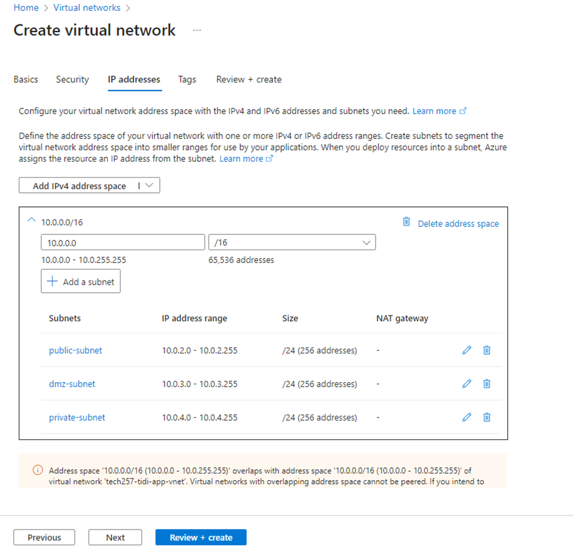
   - Ensure to select the "Enable private subnet" checkbox for the private subnet.
   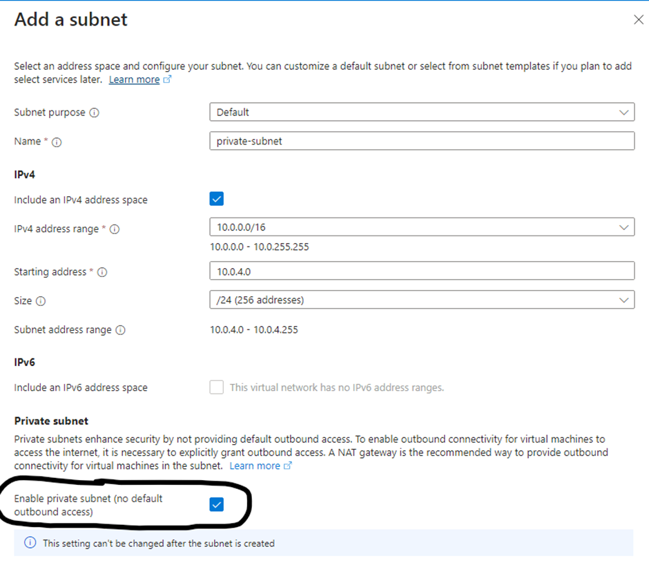
   - Review making sure the settings are as shown and create.
   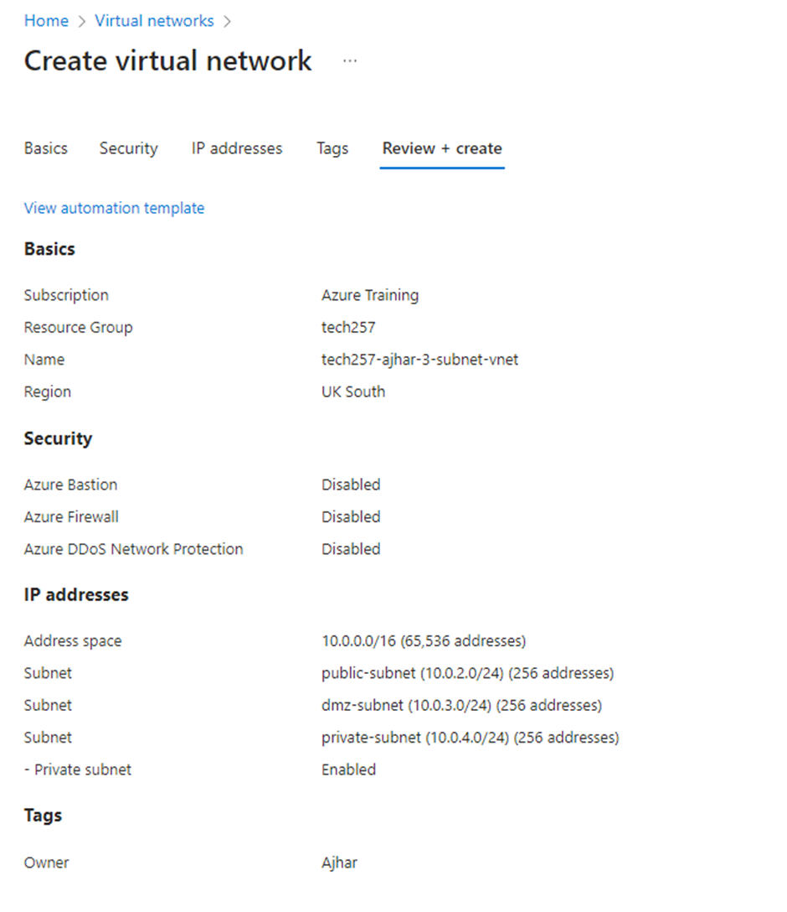


2. **Deploy Virtual Machines**:
   - Create three virtual machines: one for the application, one for the network virtual appliance (NVA), and one for the database.
   - Assign each VM to a different availability zone for increased availability.
   - Configure the database VM:
     - Use a DB-ready-to-run nva_img/image.
     - Select zone 3 for availability.
     - Allow SSH inbound.
     - Launch in the private subnet with a public IP set to "None".
     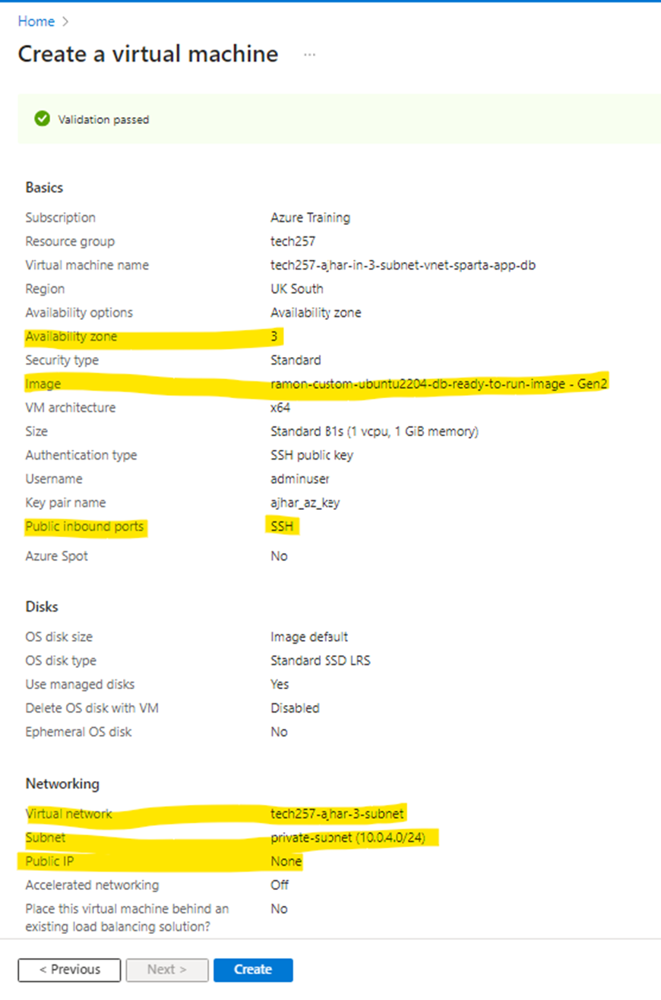
   - Configure the application VM:
     - Use an application-ready-to-run nva_img/image.
     - Select zone 1 for availability.
     - Allow SSH and HTTP traffic.
     - Launch in the public subnet.
     - Add user data to declare the DB_HOST, cd into the app folder, and run the application.
     - User data: 
       ```bash
        #!/bin/bash

        #Declare database environment variable
        export DB_HOST=mongodb://10.0.4.4:27017/posts

        # Move to app repo
        cd tech257_sparta_app/repo/app/

        # Stop any running processes
        pm2 stop all

        # Run the application using pm2
        pm2 start app.js
        ```

     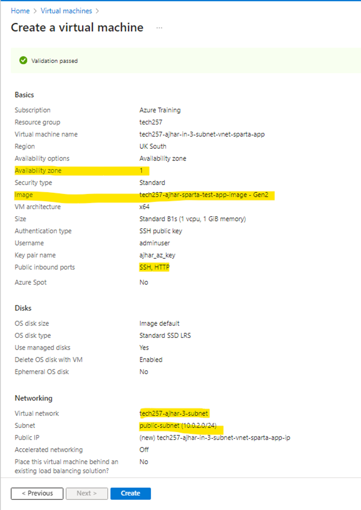

3. **Establish Database Connection**:
   - Ensure that the application and database connection is functional.
   - /posts page should be working.
   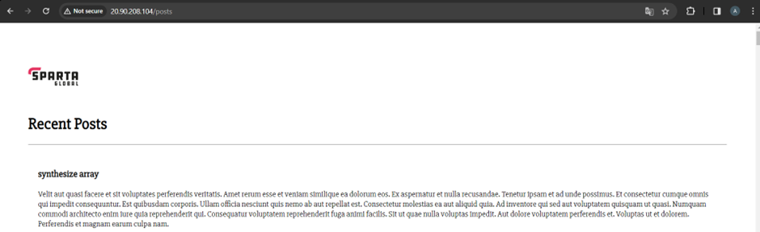
   - SSH into the application VM and test the connection by pinging the database IP.
   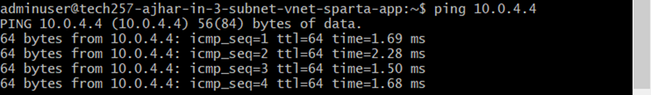

Now we will create a network virtual appliance to increase the security of our database by restricting access to only our application subnet.

4. **Deploy Network Virtual Appliance (NVA)**:
   - Use a clean Ubuntu nva_img/image for the NVA VM.
   - Select an appropriate availability zone.
   - Allow SSH and launch in the DMZ subnet.
   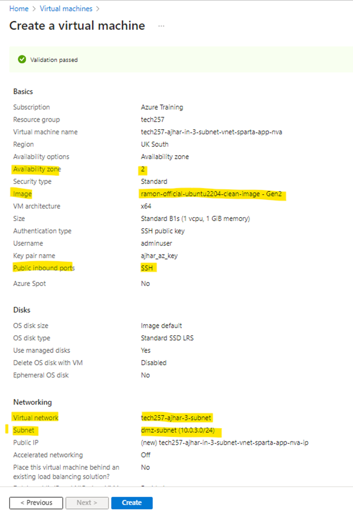

5. **Configure Routing**:
   - We will associate the route with the     public subnet, the destination is the private subnet and it will hop to the private ip of the nva where we will later forward to the database.
   - Create a route table.
   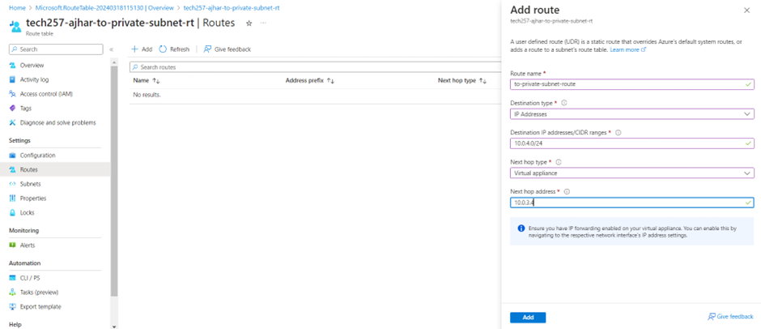
   - Add route, set the destination to the private subnet, routing through the private IP of the NVA.
    
   - In 'Subnets' ssociate the public subnet with the route table.
   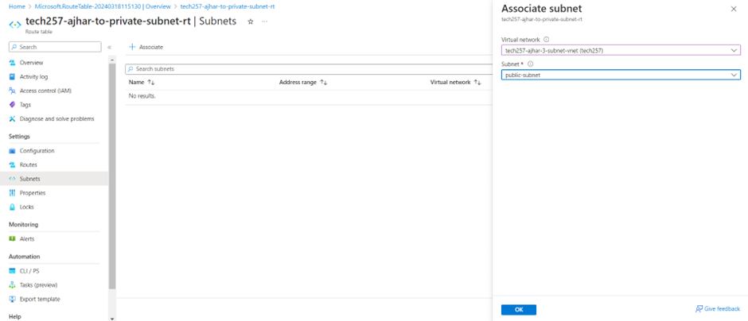 
The /posts page will stop working because ip forwarding hasn’t been enabled on nva.
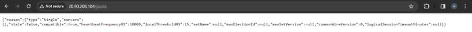
Also the ping connection will no longer give the results we want (it will stop giving new pings showing theres no connection)
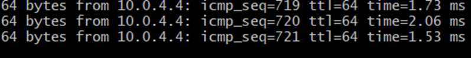

6. **Enable IP Forwarding**:
   - Enable IP forwarding on the NIC level for the NVA VM.
  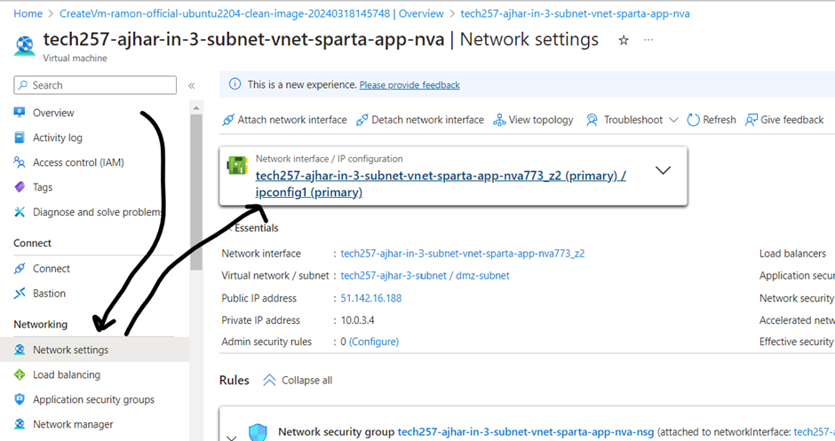
   - Now we've allowed it on the nic level but now we need to actually forward it in the vm, we will do this by sshing into the nva vm and enabling this setting.
   - If we check the ip_forward setting we can see it's set to 0 `sysctl net.ipv4.ip_forward`
   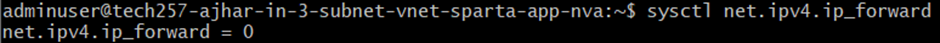
   - We will change this setting in the sysctl.conf file by uncommenting the setting  'net.ipv4.ip_forward=1`
   - Edit the sysctl.conf file to set `net.ipv4.ip_forward=1`.
   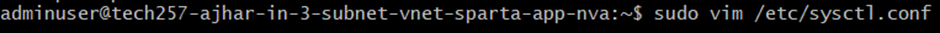
   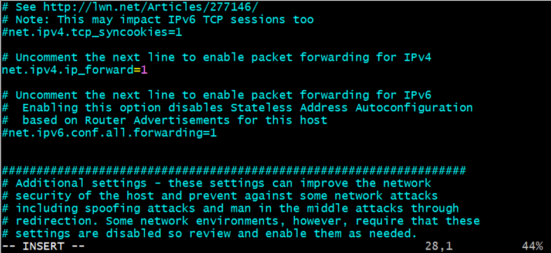
   - Reload the settings using `sudo sysctl -p`.
   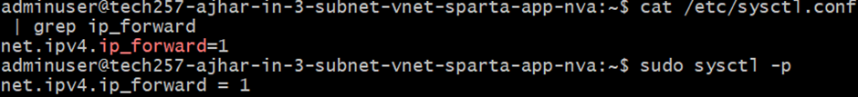
   -Now the ip is forwarded and connection resumes
   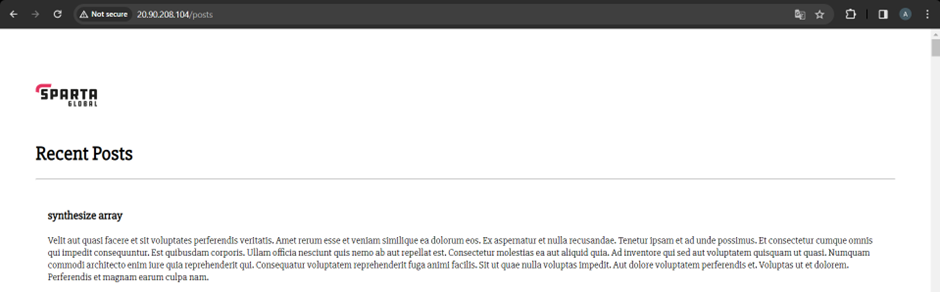
   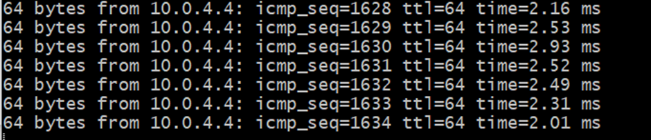

We have successfully forwarded traffic from application to database via the nva, however the nva is forwarding everything from the application and not just the connections the database needs, to deal with this we will use iptables.

7. **Configure iptables**:
   - Create and execute an iptables script to configure traffic forwarding.
    ```bash
    #!/bin/bash

    # configure iptables

    echo "Configuring iptables..."

    # Allow all traffic on the loopback interface
    sudo iptables -A INPUT -i lo -j ACCEPT
    sudo iptables -A OUTPUT -o lo -j ACCEPT

    # Allow incoming packets that are part of established or related connections
    sudo iptables -A INPUT -m state --state ESTABLISHED,RELATED -j ACCEPT

    # Allow outgoing packets that are part of established connections
    sudo iptables -A OUTPUT -m state --state ESTABLISHED -j ACCEPT

    # Drop invalid packets
    sudo iptables -A INPUT -m state --state INVALID -j DROP

    # Allow incoming SSH traffic (port 22) for new and established connections
    sudo iptables -A INPUT -p tcp --dport 22 -m state --state NEW,ESTABLISHED -j ACCEPT
    sudo iptables -A OUTPUT -p tcp --sport 22 -m state --state ESTABLISHED -j ACCEPT

    # uncomment the following lines if want allow SSH into NVA only through the public subnet (app VM as a jumpbox)
    # this must be done once the NVA's public IP address is removed
    #sudo iptables -A INPUT -p tcp -s 10.0.2.0/24 --dport 22 -m state --state NEW,ESTABLISHED -j ACCEPT
    #sudo iptables -A OUTPUT -p tcp --sport 22 -m state --state ESTABLISHED -j ACCEPT

    # uncomment the following lines if want allow SSH to other servers using the NVA as a jumpbox
    # if need to make outgoing SSH connections with other servers from NVA
    #sudo iptables -A OUTPUT -p tcp --dport 22 -m conntrack --ctstate NEW,ESTABLISHED -j ACCEPT
    #sudo iptables -A INPUT -p tcp --sport 22 -m conntrack --ctstate ESTABLISHED -j ACCEPT


    # Allow forwarding of TCP packets from the 10.0.2.0/24 subnet to the 10.0.4.0/24 subnet on port 27017 (MongoDB)
    sudo iptables -A FORWARD -p tcp -s 10.0.2.0/24 -d 10.0.4.0/24 --destination-port 27017 -m tcp -j ACCEPT

    # Allow forwarding of ICMP packets (ping) from the 10.0.2.0/24 subnet to the 10.0.4.0/24 subnet
    sudo iptables -A FORWARD -p icmp -s 10.0.2.0/24 -d 10.0.4.0/24 -m state --state NEW,ESTABLISHED -j ACCEPT

    # Set default policy to drop all incoming traffic
    sudo iptables -P INPUT DROP

    # Set default policy to drop all forwarded traffic
    sudo iptables -P FORWARD DROP

    echo "Done!"
    echo ""

    # make iptables rules persistent
    # it will ask for user input by default

    echo "Make iptables rules persistent..."
    sudo DEBIAN_FRONTEND=noninteractive apt install iptables-persistent -y
    echo "Done!"
    echo ""
    ```
    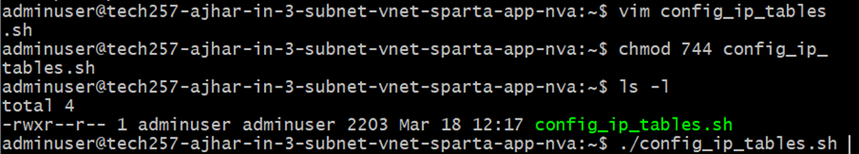
   - Ensure the the script ran and the traffic from the application to the database is properly forwarded.
   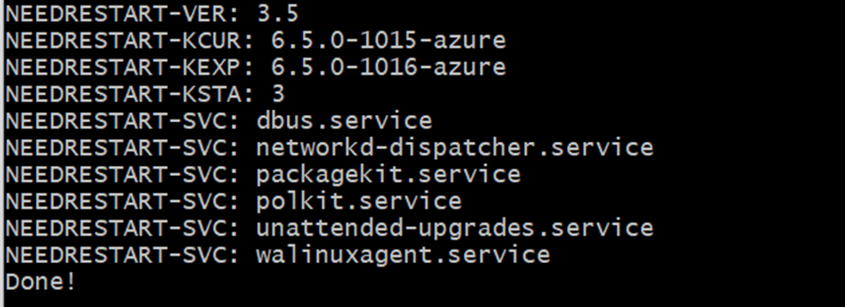
   - Verify that the `/posts` page is working and ping connections are functional.
  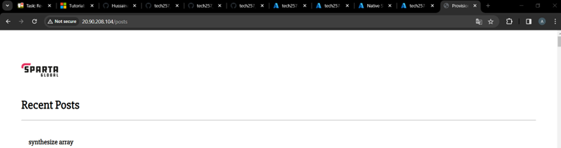
  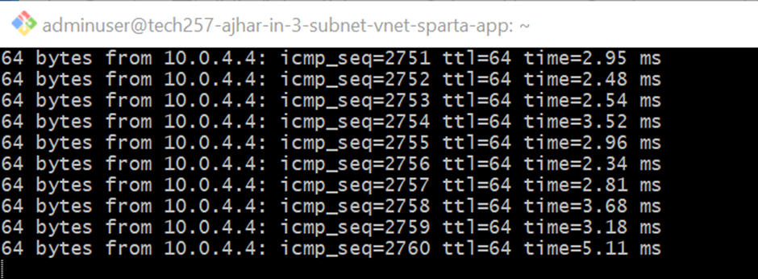

By following these steps, we have successfully established a secure architecture with the private database subnet, allowing restricted access and enhancing overall network security.
