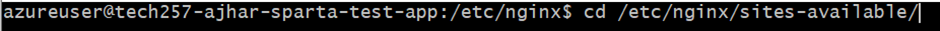

# Deployment Guide: Sparta Test App on Azure VM

To deploy Sparta Test App machine:

1. **Create VM with Ubuntu 22.04 LTS**:
   - Use Ubuntu 22.04 LTS for the VM image.
   - Create a virtual network (VNet) with CIDR range 10.0.0.0/16 and divide it into public and private subnets (e.g., public subnet: 10.0.0.0/24).
   - Launch the VM in the public subnet.
   
2. **Network Security Group (NSG)**:
   - Create a Network Security Group (NSG).
   - Allow inbound traffic for SSH (TCP port 22), HTTP (TCP port 80), and custom TCP port 3000.

## Overview

The Sparta Test App deployment involves setting up an Ubuntu 22.04 LTS Azure VM, installing Nginx, Node.js (version 20.x), and copying or cloning the app folder onto the VM. Additionally, the application needs to be started using the `npm start` or `pm2` command.

## Method 1: Copying App Folder using SCP

1. **SSH Key Setup**:
   - Add an SSH key to your local SSH agent.

2. **Copy App Folder**:
   - Navigate to the parent folder of your `tech257_sparta_app` folder.
   - Use SCP or Rsync to copy the `tech257_sparta_app` directory from your local machine to the Azure VM.<br>
   - You have to configure SSH agent with the private key for VM access:
     - Create an SSH agent process: eval `ssh-agent`
     - Add the SSH key to the SSH agent: `ssh-add ~/.ssh/<private_key_name>`
     - alternatively you can provide the input `-i ~/.ssh/<private_key_name>` to the scp command.

  <br>`scp -r path_to_app/app username@<public-ip>:/destination_path/`

## Method 2: Cloning from GitHub Repository

1. **GitHub Repository Setup**:
   - Ensure the app folder is available on a GitHub public repository called `tech257-sparta-app`.

2. **Clone Repository**:
   - On the Azure VM, use the `git clone` command to clone the `tech257-sparta-app` repository onto the VM.
  <br> Note: make sure to change into the correct directory before running npm commands (provided in order in the bash script provided at the bottom)

## Testing the Application

- Once the app is deployed, test it by accessing `<public IP>:3000` in a web browser.
- Use `CTRL+C` to exit and stop the app running.

## Bash Script for Automation

Use the provided Bash script to automate the deployment process. The script performs the following tasks:

1. Updates and upgrades the system.
2. Installs Nginx.
3. Installs Node.js (version 20.x).
4. Clones the `tech257_sparta_app` repository.
5. Installs npm and pm2.
6. Starts the application using pm2.

```bash
#!/bin/bash

# Update and upgrade the system
sudo apt update -y
sudo apt upgrade -y

# Install nginx
sudo apt install nginx -y

# Start and enable nginx
sudo systemctl restart nginx
sudo systemctl enable nginx

# Install nodejs
curl -fsSL https://deb.nodesource.com/setup_20.x | sudo -E bash -
sudo apt-get install -y nodejs

# Clone the repository
git clone https://github.com/Hussainajhar8/tech257_sparta_app.git

# Configure reverse proxy
# Backup default config file for safety measure
sudo cp /etc/nginx/sites-available/default /etc/nginx/sites-available/default_backup

# Add reverse proxy
sudo sed -i '49s/.*/                proxy_pass http:\/\/localhost:3000;/' /etc/nginx/sites-available/default

# Move to the app directory
cd tech257_sparta_app/repo/app/

# Install npm
sudo npm install

# Install pm2
sudo npm install pm2@latest -g

# Start the app
pm2 start app.js

# Restart the process
pm2 restart app.js

```

## Making a reverse proxy
### Manually
1. cd into nginx config file directory `cd /etc/nginx/sites-available/default`

2. Make a backup of the default file

3. Modify the default file at add `proxy_pass http://localhost:3000;` in location block. This will redirect requests to the (default page) to the port 3000 version.

This should work!<br>

Now automate by changing the script.
Add the following into the script but before the pm2 start.

```bash
# Configure reverse proxy
# Backup default config file for safety measure
cp /etc/nginx/sites-available/default /etc/nginx/sites-available/default_backup

# Add reverse proxy
sudo sed -i '49s/.*/                proxy_pass http:\/\/127.0.0.1:3000;/' /etc/nginx/sites-available/default
```

## Automating with User Data
To further automate the process, utilize user data:

- Manually run the commands and create a working script.
- After ensuring the script works flawlessly, use it in user data upon creating the VM.
- Create an image of the working application for easy replication on VMs.


## Creating an Azure vm image

An Azure image is a reusable, customized template for quickly creating new virtual machines. By creating and using an Azure image, you can replicate your configured VM setup across multiple instances, saving time and ensuring consistency in deployments.

Prepare Azure VM:

1. Using the terminal, in the current running VM, ensure everything is backed up and not needed as everything not in root will be wiped.
2. Run the following command to wipe everything to root level: `sudo waagent -deprovision+user`.
3. Exit the VM.

After downloading az cli, to create the image:

1. Run `az login`.
2. Using the terminal deallocate the VM using: `az vm deallocate --resource-group tech257 --name tech257-ajhar-sparta-test-app`
3. Mark the VM for image creation using: `az vm generalize --resource-group tech257 --name tech257-ajhar-sparta-test-app`
4. On the Azure portal, go to the VM and click on "Capture."
5. Name and configure as desired and click `Review + create`.<br>
   <br>
6. Click Create.
7. Once the image is created, go to the resource.
8. Click on Create VM.
9. Fill in the details using this image and click Review + create.<br>
   <br>
10. Click Create.